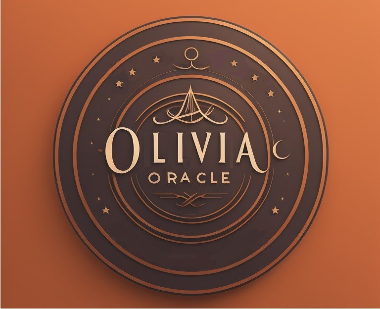

# OliviaOracle - A Simple Assistant

<p align="center">
  
</p>


## How to Use

### Setups
* Install dependencies
    * pip3 install -r requirements.txt
* Paste Open AI API key into file openaiapikey.txt
* Paste Eleven Labs API key into file elevenlabsapikey.txt

### Running
```bash
# for default settings (english language)
cd olivia
./main.py 

# for portuguese language
cd olivia
LANGUAGE=pt ./main.py 
```

### Ubuntu Requirements
 - ffmpeg


### Docker
 - Soon


### Technical Details

Speech To Text
 - [Whisper](https://openai.com/research/whisper)

Text to Speech
 - [Elevenlabs](https://elevenlabs.io/)


ElevenLabs Docs
 - https://api.elevenlabs.io/docs

OpenAI Docs
 - https://platform.openai.com/docs/api-reference 


## Inspiration
This project began as inspiration of [this project](https://github.com/AllAboutAI-YT/talk-to-chatgpt) which has a demo on [this youtube video](https://www.youtube.com/watch?v=bZhgoYrHC3w&ab_channel=AllAboutAI)
